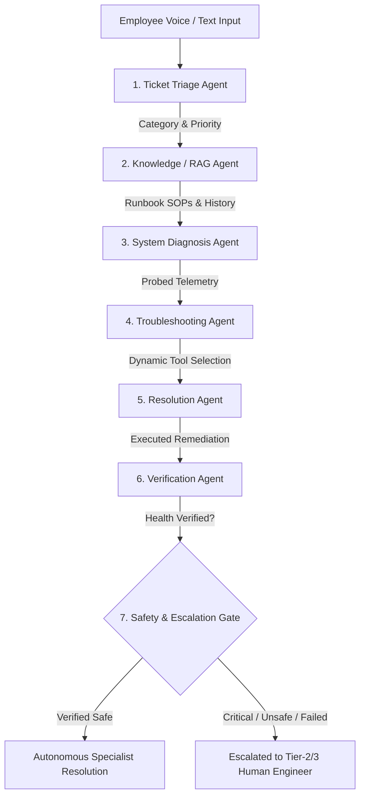

# ✦ FIXORA AI — Project Pitch & Judges Explanation Guide
### Problem Statement #12: Autonomous IT Service Desk Agent
**Multi-Agent Orchestration · Dynamic Tool Selection · Deterministic Safety · Instant Human Handover**

---

## 📌 1. Executive Summary (The 30-Second Elevator Pitch)

> **Fixora AI** is an autonomous, enterprise-grade IT Service Desk assistant that investigates, diagnoses, remediates, and verifies workplace technical incidents in under 5 seconds.
>
> Instead of leaving employees stranded in multi-hour IT ticket queues, Fixora AI coordinates a pipeline of **7 specialized reasoning agents** to resolve routine incidents (VPN dropouts, account lockouts, network IP lease stalls, print spooler queue jams, PC boot diagnostics, and software provisioning) with verified safety, while providing an instant **1-click direct on-call human technician handover** when live engineering intervention is needed.

---

## 🎯 2. Problem Statement & Real-World Industry Challenge

### The Problem in Enterprise IT Today:
1. **Massive Ticket Backlogs**: 60% to 70% of enterprise IT desk volume consists of repetitive tier-1 issues (VPN disconnects, password resets, Wi-Fi drops, print buffer stalls).
2. **Long Resolution Latency**: Employees wait an average of **4 to 8 hours** for a simple 30-second fix, costing enterprises millions in lost productive hours.
3. **The Danger of Unsafe GenAI**: Raw Large Language Models (LLMs) cannot be allowed to execute destructive OS commands without safeguards (e.g., formatting partitions, flashing BIOS, or restarting production nodes).
4. **The "AI Loop" Trap**: Chatbots often frustrate users by repeating unhelpful automated answers when an issue requires physical or tier-2 human intervention.

---

## 🏗️ 3. Fixora AI Architecture (7-Stage Multi-Agent Pipeline)



### The 7 Specialized Agents Explained:

| Stage | Agent Name | Core Responsibility |
| :--- | :--- | :--- |
| **1** | **Ticket Triage Agent** | Analyzes symptoms using regex & NLP to classify into domains (`hardware`, `vpn`, `network`, `printer`, `authentication`, `software`) and determines priority (`medium`, `high`, `critical`). |
| **2** | **Knowledge / RAG Agent** | Performs hybrid keyword & semantic search against approved IT runbooks (`KB-BOOT-001`, `KB-VPN-001`, `KB-AUTH-001`, etc.) and retrieves previous ticket precedents from PostgreSQL. |
| **3** | **System Diagnosis Agent** | Probes simulated endpoint & infrastructure telemetry (power rail signals, gateway latency, LDAP lockout flags, DHCP lease timers, CPU/RAM contention). |
| **4** | **Troubleshooting Agent** *(Key PS #12 Challenge)* | **Dynamically evaluates candidate tools** based on risk and symptoms (e.g., purges print spooler rather than rebooting host OS; avoids risky BIOS reflash on unpowered hardware). |
| **5** | **Resolution Agent** | Executes selected non-destructive simulated remediation tools (`reset_vpn_session`, `unlock_user_account`, `renew_dhcp_lease`, `restart_print_spooler`, `hardware_power_diagnostic`, `clean_temp_cache`). |
| **6** | **Verification Agent** | Validates that system parameters have returned to normal operating thresholds before confirming resolution. |
| **7** | **Escalation / Safety Gate** | Deterministically halts automated execution if an incident breaches safety boundaries (e.g., production outages, data loss risks) or fails verification. |

---

## 🌟 4. What Makes Fixora AI Winning & Unique?

### 1. Dynamic Tool Selection (Not Hardcoded Logic)
Fixora AI doesn't follow static `if/else` scripts. For every problem, it analyzes the evaluated tool matrix, weighs user disruption, and selects the least invasive, highest-confidence tool.

### 2. Humanized Frontdesk Specialist Synthesis
Instead of spitting raw JSON or robotic messages, Fixora AI formats replies like a top-tier enterprise IT Specialist:
* **Empathetic Greeting**: Acknowledges user disruption.
* **What I've Fixed For You**: Clear summary of background actions taken.
* **Numbered Actionable Steps**: Step-by-step instructions for the employee to resume working.

### 3. 1-Click Direct Human Technician Handover (Zero AI Delay)
If automated steps don't solve the issue or if mechanical failure is present, employees click **[👨‍💻 Assign to Human IT Specialist]**:
* **Bypasses all AI reasoning** with zero delay.
* Automatically dispatches to the qualified on-call engineer:
  * 💻 **Hardware / Boot**: Marcus Vance *(Desktop Support · Desk Ext. 4091 · ETA < 4m)*
  * 🖨️ **Printer / Spooler**: Elena Rostova *(Office IT · Floor-3 Pager #212 · ETA < 5m)*
  * 🌐 **VPN / Network**: Devon Reed *(NetOps Security · Ext. 4022 · ETA < 3m)*
  * 🔑 **Account / MFA**: Amina Diallo *(Identity & IAM · Ext. 4015 · ETA < 2m)*
  * 🪟 **Software / Intune**: Liam O'Connor *(Endpoint Engineering · Ext. 4066 · ETA < 5m)*
  * 🚨 **Critical Outages**: Sarah Jenkins *(Incident Commander · Tier-3 Pager #991)*

### 4. Interactive Voice Desk & Real-Time TTS
Full Web Speech API integration allowing non-technical employees to speak their problems hands-free with spoken audio responses.

### 5. PostgreSQL & SQLite Universal Data Store
Every agent run, evaluated evidence, and execution trace is persisted in PostgreSQL with auto-migrating SQLite fallback.

---

## 🎤 5. Two-Minute Pitch Script for Judges

```text
"Judges, every day millions of enterprise employees waste 4 to 8 hours waiting in IT ticket 
queues for routine issues like VPN drops, account lockouts, or printer jams.

We created Fixora AI — an Autonomous IT Service Desk powered by multi-agent reasoning 
and deterministic safety.

When an employee types or speaks an issue, Fixora AI coordinates 7 specialized agents:
1. It triages the domain and priority.
2. It retrieves verified knowledge runbooks and previous ticket history from PostgreSQL.
3. It diagnoses root causes against system telemetry.
4. It dynamically selects the safest remediation tool while rejecting risky alternatives.
5. It executes approved actions in the background.
6. It verifies that system health is restored.
7. And if safety policy requires it, it safely escalates to human engineers.

What makes Fixora AI enterprise-ready is our dual-layer safety:
First, our AI acts like an expert frontdesk specialist with step-by-step instructions.
Second, we built an instant 1-Click Human Handover feature. If an automated fix isn't 
enough, employees bypass AI with one click to dispatch the ticket directly to our on-call 
Tier-2 technician roster with full telemetry and an ETA under 4 minutes.

Fixora AI transforms enterprise IT from a 6-hour waiting queue into an instant 5-second 
autonomous resolution experience. Thank you!"
```

---

## 🧪 6. Three Live Demo Scenarios for Judges

### Scenario A: Autonomous VPN Remediation
* **Prompt**: `"My VPN is not connecting and corporate gateway keeps timing out."`
* **Agent Flow**: Triaged as VPN $\to$ dynamic tool `reset_vpn_session` selected $\to$ gateway latency (18ms) & tunnel IP (`10.8.0.45`) verified $\to$ humanized reconnection steps delivered.

### Scenario B: PC Boot Failure & 1-Click Human Handover
* **Prompt**: `"My PC is not booting up and screen is black."`
* **Agent Flow**: Triaged as Hardware $\to$ matches `KB-BOOT-001` $\to$ power diagnostic executed $\to$ cold reset capacitor drain steps delivered $\to$ **Click [👨‍💻 Assign to Human IT Specialist]** $\to$ Ticket instantly transitions to `DISPATCHED_TO_TIER2` assigned to Marcus Vance (ETA < 4m).

### Scenario C: Critical Infrastructure Safety Boundary
* **Prompt**: `"Critical production database server is down and compromised."`
* **Agent Flow**: Triaged as Critical $\to$ autonomous remediation strictly blocked by Safety Gate $\to$ escalated to Tier-3 Incident Commander Sarah Jenkins with audit logs.
